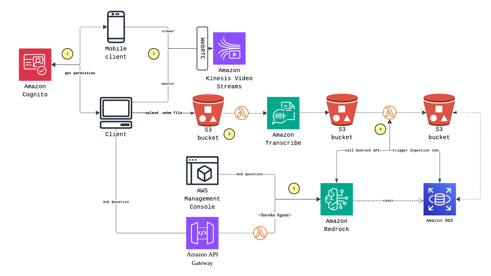
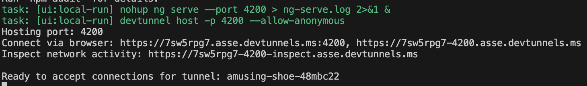
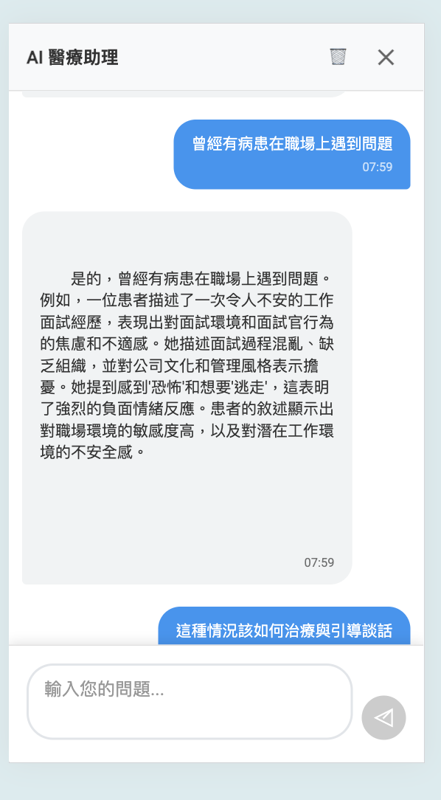
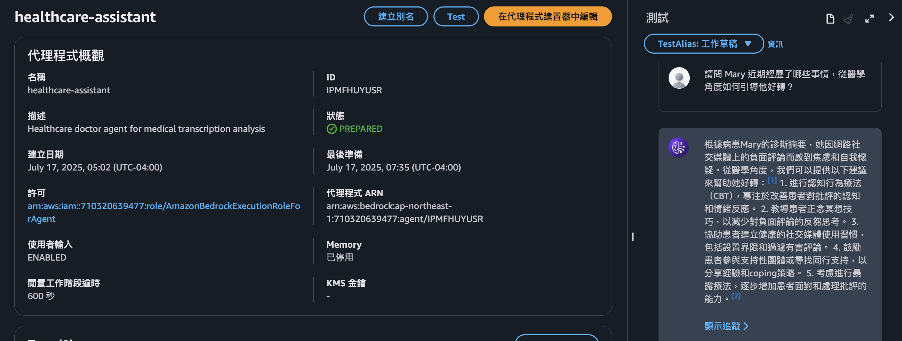

# Healthcare.io

## 🔄 系統流程

工作流程如下：



### 主要處理流程

1. **身份驗證與權限取得**

   - 使用者透過 Amazon Cognito 進行身份驗證
   - 獲取必要的 AWS 服務存取權限
2. **視訊通話與音訊錄製**

   - Mobile Client (Viewer) 與 Web Client (Master) 建立 WebRTC 連線
   - 透過 Amazon Kinesis Video Streams 進行即時視訊串流
   - 錄製音訊並上傳至 S3 bucket
3. **音訊轉錄處理**

   - S3 事件觸發 Transcriber Lambda 函數
   - 呼叫 Amazon Transcribe 服務進行語音轉文字
   - 轉錄結果存儲至另一個 S3 bucket
4. **AI 分析與摘要**

   - 轉錄結果觸發 Transcribe-Summary Lambda 函數
   - 呼叫 Amazon Bedrock API 針對逐字稿進行整理，生成醫療摘要和見解
   - 觸發 Ingestion Job 將資料同步至 Amazon RDS
5. **問答服務**

   - 整合 ApiGateway + Lambda 執行 AI Agent 進行回答
   - 系統可基於過往病歷內容，提供語意理解與上下文建議，輔助醫師判斷

## 📦 專案結構

```
healthcare.io/
├── healthcare.io.chatbot/              # 聊天機器人 Lambda 函數
│   ├── src/healthcare.io.chatbot/  
│   ├── Dockerfile  
│   └── taskfile.yml  
├── healthcare.io.ui/                   # Angular 前端應用
│   ├── src/app/  
│   ├── src/environments/  
│   └── package.json  
├── healthcare.io.transcriber/          # 音訊轉錄 Lambda 函數
│   ├── src/healthcare.io.transcriber/  
│   ├── Dockerfile  
│   └── taskfile.yml  
├── healthcare.io.transcribe-summary/   # AI 分析與摘要 Lambda 函數
│   ├── src/healthcare.io.transcribe-summary/  
│   ├── Dockerfile   
│   └── taskfile.yml   
├── healthcare.io.infra/                # Terraform 基礎設施即代碼
│   ├── agw.tf  
│   ├── main.tf  
│   ├── cognito.tf   
│   ├── lambda.tf  
│   ├── s3.tf   
│   ├── kvs.tf   
│   └── bedrock.tf  
├── healthcare.io.DI/                   # 依賴注入共用庫
└── taskfile.yml                        # 根目錄任務配置
```

### 各組件說明

- **healthcare.io.ui**：提供 WebRTC 視訊通話介面
- **healthcare.io.transcriber**：處理音訊轉錄的 Lambda 函數
- **healthcare.io.transcribe-summary**：進行 AI 分析與知識庫同步的 Lambda 函數
- **healthcare.io.chatbot**：轉呼叫 AI Agent 處理使用者回應
- **healthcare.io.infra**：使用 Terraform 管理的 AWS 基礎設施配置

## 🚀 快速開始

### 前置要求

| 工具                  | 版本要求 | 下載位址                                                                                                                           |
| --------------------- | -------- | ---------------------------------------------------------------------------------------------------------------------------------- |
| **Node.js**     | 18+      | [下載位址](https://nodejs.org/en/download)                                                                                            |
| **.NET SDK**    | 8        | [下載位址](https://dotnet.microsoft.com/zh-tw/download/dotnet/8.0)                                                                    |
| **Terraform**   | -        | [下載位址](https://developer.hashicorp.com/terraform/install)                                                                         |
| **Docker**      | -        | [下載位址](https://docs.docker.com/desktop/setup/install/mac-install/)                                                                |
| **Angular CLI** | -        | [下載位址](https://www.npmjs.com/package/@angular/cli)                                                                                |
| **Devtunnel**   | -        | [下載位址](https://learn.microsoft.com/zh-tw/azure/developer/dev-tunnels/get-started?tabs=macos)                                      |
| **go-task**     | -        | [下載位址](https://taskfile.dev/installation/)                                                                                        |
| **aws cli**     | -        | [下載位址](https://docs.aws.amazon.com/zh_tw/cli/latest/userguide/getting-started-install.html#getting-started-install-instructions/) |

### AWS 環境設定

確保本地環境已正確配置 AWS 憑證，具備建置基礎設施的必要權限。可參考 [AWS CLI 配置指南](https://docs.aws.amazon.com/zh_tw/cli/latest/userguide/cli-configure-quickstart.html)。

### 部署步驟

#### 1. 複製專案並進入目錄

```bash
git clone <repository-url>
cd healthcare.io
```

#### 2. 部署 AWS 基礎設施和服務

```bash
# 建置基礎設施
task infra-up

# 部署音訊轉錄 Lambda 函數
task deploy-transcriber

# 部署 AI 分析摘要 Lambda 函數
task deploy-summary

# 部署 助理聊天機器人
task deploy-chatbot

# 啟動前端開發伺服器
task local-frontend-run
```

#### 3. 測試系統功能

應用程式將透過 `Devtunnel` 代理啟動，如下圖所示：



**測試步驟：**

1. 從裝置透過瀏覽器輸入網址（如範例：`https://7sw5rpg7-4200.asse.devtunnels.ms`）

   - 起始畫面如下
     
2. 點擊「Start Master」按鈕啟動主控端
3. 從另一台裝置的瀏覽器輸入相同網址
4. 點擊「Start Viewer」按鈕啟動觀看端
5. 確認視訊連線正常，開始進行通話
6. 在 Master 端可以點擊「Start Recording」/「Stop Recording」按鈕進行錄音和上傳
7. 資料同步完畢後，可按下右下角「聊天按鈕」進行討論或往 AWS Bedrock Agent Console 進行 AI 問答測試
   >上下文同步需要等 IngestJob 執行完畢，可能需要一點時間

   - Chat Call API
   - 或是至 AWS Bedrock Agent Console 詢問
     

#### 4. 模擬音檔測試（可選）

如需要模擬音檔進行測試，可執行以下指令：

```bash
# 下載並上傳模擬音檔
task download-mock-speech
```

此功能透過 `AWS Polly` 讀取[模擬腳本](./healthcare.io.transcriber/src/healthcare.io.transcriber/mock-speech.ssml)並產出音檔，上傳至 S3 Bucket `healthcare-io-audio`，模擬完整的音訊處理流程。

#### 5. 清理資源

測試完畢後，請執行以下指令清理資源：

```bash
# 停止前端服務
task local-frontend-down

# 清理基礎設施
task infra-down
```

> **注意**：請確保已正確配置 AWS 憑證和權限。詳細的基礎設施配置說明請參考 [infra 目錄](./healthcare.io.infra/)。

## ⚠️ 重要安全聲明

> **警告**：目前為概念驗證，**尚未配置 PHI (Protected Health Information) 和 HIPAA 相關的安全保護措施**。
>
> **請勿直接用於處理真實的醫療資料或部署至生產環境**。
